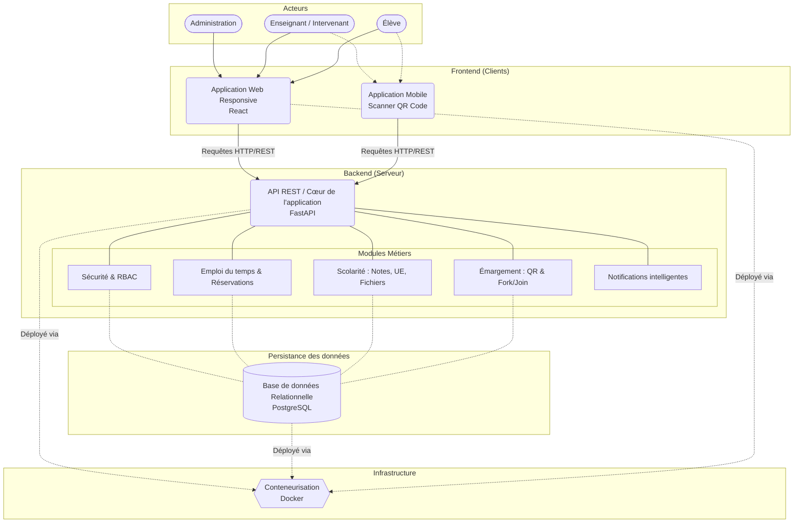

```mermaid
flowchart TD
    subgraph Acteurs
        Admin([Administration])
        Eleve([Élève])
        Prof([Enseignant / Intervenant])
    end

    subgraph "Frontend (Clients)"
        Web(Application Web Responsive<br/>React)
        Mobile(Application Mobile<br/>Scanner QR Code)
    end

    subgraph "Backend (Serveur)"
        API(API REST / Cœur de l'application<br/>FastAPI)
        
        subgraph "Modules Métiers"
            Auth[Sécurité & RBAC]
            Agenda[Emploi du temps & Réservations]
            Peda[Scolarité : Notes, UE, Fichiers]
            Emarg[Émargement : QR & Fork/Join]
            Notif[Notifications intelligentes]
        end
    end

    subgraph "Persistance des données"
        Bdd[(Base de données Relationnelle<br/>PostgreSQL)]
    end

    subgraph "Infrastructure"
        Conteneurs{{Conteneurisation<br/>Docker}}
    end

    %% Connexions Acteurs -> Frontend
    Admin --> Web
    Prof --> Web
    Eleve --> Web
    Prof -.-> Mobile
    Eleve -.-> Mobile

    %% Connexions Frontend -> Backend
    Web -->|Requêtes HTTP/REST| API
    Mobile -->|Requêtes HTTP/REST| API

    %% Connexions API -> Modules
    API --- Auth
    API --- Agenda
    API --- Peda
    API --- Emarg
    API --- Notif

    %% Connexions Modules -> BDD
    Auth -.- Bdd
    Agenda -.- Bdd
    Peda -.- Bdd
    Emarg -.- Bdd

    %% Infrastructure
    API -.->|Déployé via| Conteneurs
    Bdd -.->|Déployé via| Conteneurs
    Web -.->|Déployé via| Conteneurs
```
