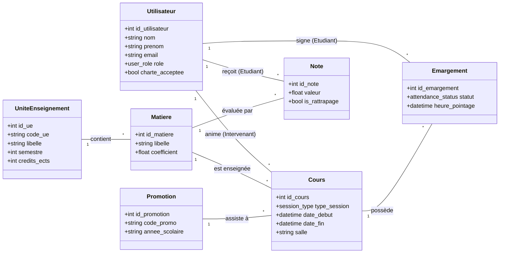

```mermaid

classDiagram
    direction LR

    class Utilisateur {
        +int id_utilisateur
        +string nom
        +string prenom
        +string email
        +user_role role
        +bool charte_acceptee
    }

    class Promotion {
        +int id_promotion
        +string code_promo
        +string annee_scolaire
    }

    class UniteEnseignement {
        +int id_ue
        +string code_ue
        +string libelle
        +int semestre
        +int credits_ects
    }

    class Matiere {
        +int id_matiere
        +string libelle
        +float coefficient
    }

    class Cours {
        +int id_cours
        +session_type type_session
        +datetime date_debut
        +datetime date_fin
        +string salle
    }

    class Note {
        +int id_note
        +float valeur
        +bool is_rattrapage
    }

    class Emargement {
        +int id_emargement
        +attendance_status statut
        +datetime heure_pointage
    }

    %% Relations
    UniteEnseignement "1" -- "*" Matiere : contient
    Utilisateur "1" -- "*" Cours : anime (Intervenant)
    Utilisateur "1" -- "*" Emargement : signe (Etudiant) 
    Utilisateur "1" -- "*" Note : reçoit (Etudiant)
    Matiere "1" -- "*" Note : évaluée par
    Matiere "1" -- "*" Cours : est enseignée
    Promotion "1" -- "*" Cours : assiste à
    Cours "1" -- "*" Emargement : possède
```