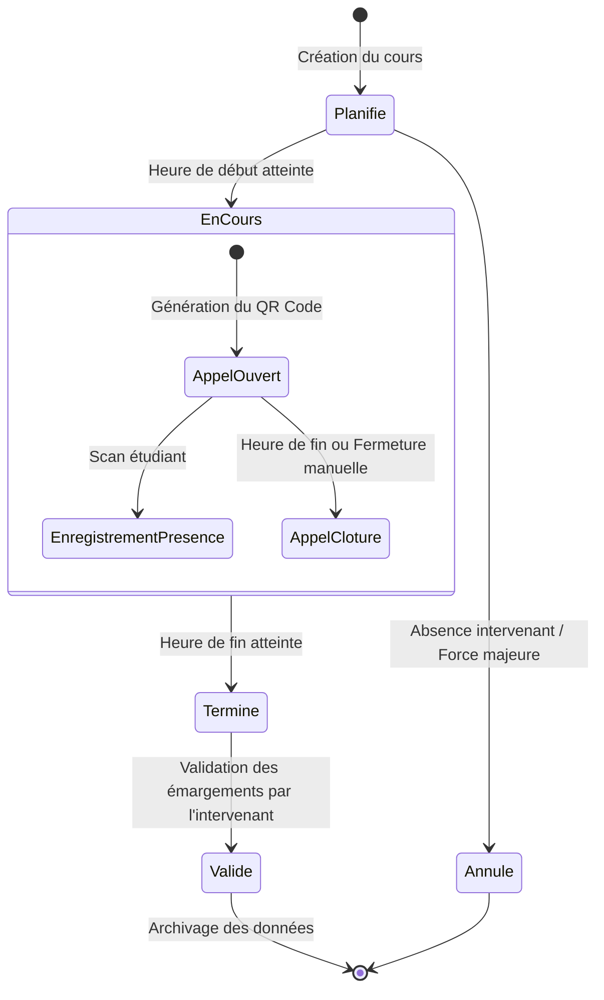

```mermaid
stateDiagram-v2
    [*] --> Planifie : Création du cours
    
    Planifie --> EnCours : Heure de début atteinte
    Planifie --> Annule : Absence intervenant / Force majeure
    
    state EnCours {
        [*] --> AppelOuvert : Génération du QR Code
        AppelOuvert --> EnregistrementPresence : Scan étudiant
        AppelOuvert --> AppelCloture : Heure de fin ou Fermeture manuelle
    }
    
    EnCours --> Termine : Heure de fin atteinte
    Termine --> Valide : Validation des émargements par l'intervenant
    Valide --> [*] : Archivage des données
    Annule --> [*]
```