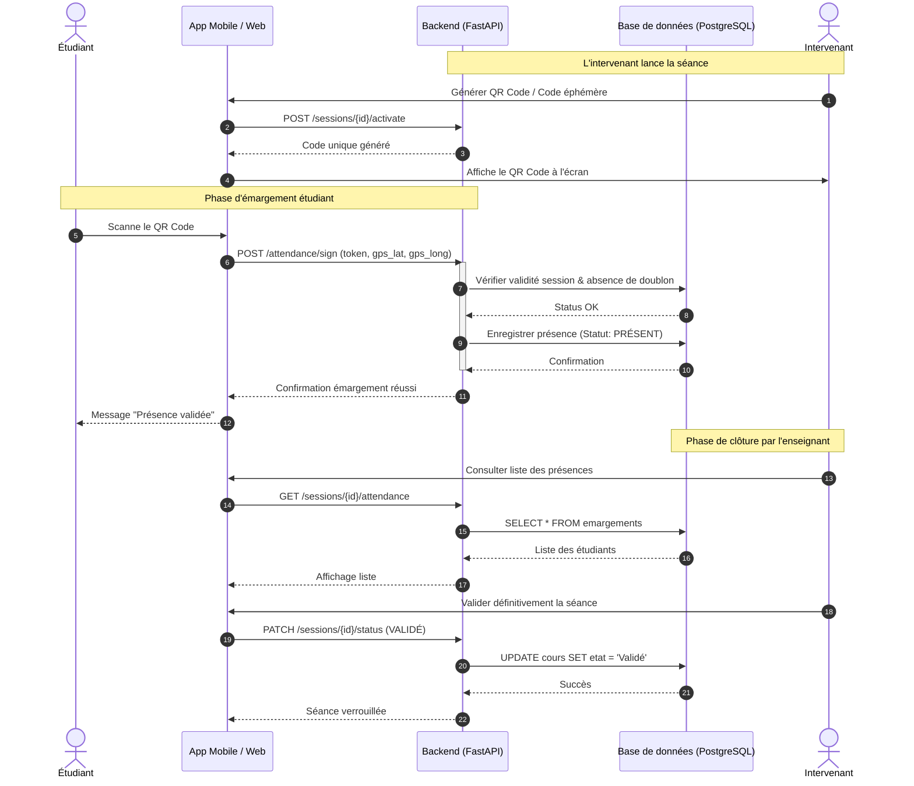

```mermaid
sequenceDiagram
    autonumber
    actor E as Étudiant
    participant APP as App Mobile / Web
    participant API as Backend (FastAPI)
    participant DB as Base de données (PostgreSQL)
    actor I as Intervenant

    Note over I, API: L'intervenant lance la séance
    I->>APP: Générer QR Code / Code éphémère
    APP->>API: POST /sessions/{id}/activate
    API-->>APP: Code unique généré
    APP->>I: Affiche le QR Code à l'écran

    Note over E, API: Phase d'émargement étudiant
    E->>APP: Scanne le QR Code
    APP->>API: POST /attendance/sign (token, gps_lat, gps_long)
    
    activate API
    API->>DB: Vérifier validité session & absence de doublon
    DB-->>API: Status OK
    
    API->>DB: Enregistrer présence (Statut: PRÉSENT)
    DB-->>API: Confirmation
    deactivate API
    
    API-->>APP: Confirmation émargement réussi
    APP-->>E: Message "Présence validée"

    Note over I, DB: Phase de clôture par l'enseignant
    I->>APP: Consulter liste des présences
    APP->>API: GET /sessions/{id}/attendance
    API->>DB: SELECT * FROM emargements
    DB-->>API: Liste des étudiants
    API-->>APP: Affichage liste
    
    I->>APP: Valider définitivement la séance
    APP->>API: PATCH /sessions/{id}/status (VALIDÉ)
    API->>DB: UPDATE cours SET etat = 'Validé'
    DB-->>API: Succès
    API-->>APP: Séance verrouillée
```