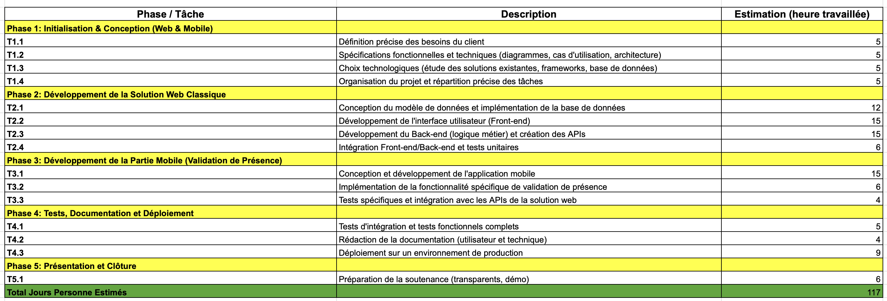
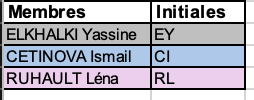
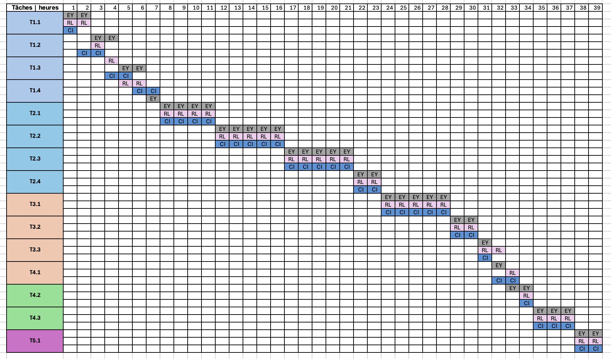

<table>
<tr>
<td style="vertical-align:top; padding-right:1.5em; width:60%;">
<h1>TP1 Réseaux</h1>
<ul>
<li>Membres :<ul>  
	<li>Yassine ELKHALKI</li>
	<li>Léna RUHAULT</li>
	<li>Ismail CETINOVA</li>
	</ul>
	</li>
<li>Dépôt Github : <a href='https://github.com/YassouSensai/MonCNAM.git'>https://github.com/YassouSensai/MonCNAM.git</a></li>
</ul>
</td>
<td style="vertical-align:top; text-align:right; width:40%;">

</td>
</tr>
</table>

---

# Sommaire
1. [Introduction](#introduction)
	- [Le sujet](#sujet)
	- [Le besoin](#besoins)
2. [Spécification des besoins](#specification-des-besoins)
	- [Les besoins fonctionnels](#besoins-fonctionnels)
	- [Les besoins non fonctionnels](#besoins-non-fonctionnels)
3. [Organisation du projet](#organisation-du-projet)
	- [Méthodologie et outils](#méthodologie-et-outils)
	- [Planning](#planing)

## Introduction
### Sujet
Le projet consiste à concevoir et développer une plateforme web centralisée dédiée à la gestion administrative et pédagogique de la filière FIP Informatique du Cnam. L'outil s’inspirera de du système d’information actuelle : [Galao (Landy-Authentification (GALAO))](https://galao.cnam.fr/eiparis/index.php)
permettant le pilotage des promotions, le suivi de l'assiduité, la gestion du cursus académique, l’accès à l’emploi du temps…

En supplément et en fonction du temps, une fonctionnalité innovante sera ajoutée : elle permettra aux élèves d'émarger à chaque cours via leur smartphone, et aux professeurs d'accéder aux présences de façon digitalisée et sécurisée.

### Besoins
Le projet répond au besoin de moderniser et de centraliser la gestion de la filière en créant une plateforme web unique, enrichie de fonctionnalités collaboratives. L’objectif est de simplifier le quotidien de trois types d’utilisateurs :

- **Pour l’administration :** Piloter efficacement les promotions, suivre le parcours académique des élèves (notes, crédits) et garantir la conformité du suivi d'assiduité, un point critique pour les formations en alternance.

- **Pour les enseignants :** Supprimer la gestion manuelle des présences grâce à un outil digital permettant de visualiser et de valider l'appel en temps réel.

- **Pour les élèves :** Offrir un point d'accès unique pour consulter l'emploi du temps et permettre un émargement numérique rapide et autonome lors des cours.

Ce projet vise à transformer un système d'information de gestion classique en un outil de pilotage dynamique, fluidifiant la communication entre l'école, les intervenants et les étudiants.

## Specification des besoins
### Besoins fonctionnels
La plateforme doit avant tout servir de point de contact quotidien pour les différents acteurs de la FIP. Au cœur du système, l’emploi du temps constitue le besoin primaire : il est impératif que les étudiants et les enseignants puissent consulter en temps réel leur planning personnalisé, avec une distinction claire des salles et des enseignements via un code couleur intuitif. Pour l’administration, la plateforme doit offrir une souplesse totale permettant de planifier des cours, des examens ou des réunions, tout en gardant une visibilité sur la disponibilité des salles.

En ce qui concerne le suivi pédagogique, l'étudiant doit disposer d'un accès strictement personnel à son propre relevé de notes. Les notes sont agrégées par matières, elles-mêmes regroupées dans des Unités d'Enseignement (UE) réparties sur des semestres. Le système doit être capable de gérer l'opérabilité des coefficients et les spécificités des tests de langue pour calculer automatiquement les moyennes pondérées, tout en archivant les résultats pour les sessions de rattrapage. Parallèlement, chaque cours doit devenir un espace de partage où l'enseignant dépose ses supports (slides, exercices, annales) et définit les modalités d'évaluation, avec la possibilité de rendre certaines informations publiques ou de les restreindre aux inscrits.

Un besoin critique identifié concerne la justification de l'assiduité, indispensable dans le cadre de l'apprentissage. La plateforme doit automatiser ce processus : à chaque début de cours, un code unique et éphémère doit être généré aléatoirement par le système. L'étudiant a alors la responsabilité de valider sa présence en saisissant ce code ou en scannant un QR code depuis son interface. L'enseignant doit cependant conserver une autorité de contrôle, lui permettant de valider ou d'invalider manuellement les présences en fin de séance pour garantir la fiabilité des registres.

Enfin, la fluidité de l'information doit être assurée par un système de notifications intelligent. Il ne s'agit pas seulement d'envoyer des emails, mais de cibler précisément les groupes concernés (apprentis d'une promotion, tuteurs, ou intervenants spécifiques) pour les informer d'un changement d'emploi du temps, de la publication d'une nouvelle note ou de la mise à disposition d'un document.

### Besoins non fonctionnels
La plateforme doit avant tout reposer sur une sécurité d'accès rigoureuse, étant donné la sensibilité des données académiques et personnelles traitées. Le système doit intégrer une gestion des droits basée sur les rôles (RBAC), garantissant que seuls les administrateurs peuvent modifier les structures de cours, tandis que les étudiants et enseignants sont strictement cantonnés à leurs périmètres respectifs. L'intégrité des données est primordiale : chaque accès et modification critique (comme la saisie des notes) doit être sécurisé et tracé. De plus, la conformité juridique est assurée par l'obligation pour chaque utilisateur de signer numériquement la charte informatique de l'établissement avant toute navigation, répondant ainsi aux exigences de responsabilité partagée.  

Sur le plan de l'ergonomie et de l'interface, le système doit impérativement respecter la charte graphique du Cnam afin d'offrir une expérience utilisateur cohérente avec les autres outils institutionnels. L'interface doit être "responsive", permettant une consultation fluide sur ordinateur pour la gestion administrative, mais aussi sur smartphone pour les étudiants, notamment pour la saisie rapide des codes de présence en début de cours. L'accent doit être mis sur la simplicité et la clarté : l'emploi du temps doit être lisible en un coup d'œil et les formulaires de saisie de notes doivent minimiser les risques d'erreurs de frappe par des contrôles de cohérence immédiats.  

En termes de performance et de disponibilité, l'architecture doit être conçue pour supporter des pics de connexion simultanés, typiquement lors des débuts de cours pour l'émargement ou lors de la publication des résultats d'examens. L'utilisation de technologies modernes comme FastAPI et React, couplée à une base de données PostgreSQL robuste, doit garantir des temps de réponse inférieurs à la seconde pour les requêtes courantes. La conteneurisation via Docker est une exigence technique forte : elle doit permettre un déploiement reproductible et simplifié, facilitant la maintenance et les futures évolutions de la plateforme par de nouvelles équipes.  

Enfin, la maintenabilité et la scalabilité sont des piliers du projet. Le code doit être structuré de manière modulaire pour que de nouvelles fonctionnalités puissent être ajoutées sans compromettre l'existant. L'archivage des données est également une contrainte majeure : le système doit être capable de conserver l'historique des notes et des promotions sur plusieurs années, tout en respectant les principes du RGPD concernant la durée de conservation des données personnelles et la possibilité d'exportation pour l'archivage administratif.  

## Organisation du projet
### Méthodologie et outils
Au vue de la durée du projet et de l'importance d'une bonne coordination entre nos trois membres, nous avons décider de partir sur une organisation linéaire des tâches et non sur une méthodologie agile.
Voici ci-dessous la liste des tâches (non exhaustive).

Pour chaque tâche, chacun des membres interviendra. Ainsi nous nous coordinons via Github Project. En effet chaque tâche sera divisée en plusieurs sous tâches que nous pourrons nous appriprier.

### Planing
Planning non définitif en nombre d'heures ce qui comprend les heures du planning et les heures de travail en plus.

Pour mieux visualiser le planing, il se trouve [ici](https://docs.google.com/spreadsheets/d/1oUmpsSupdnOnIuKPobgLwjDSZzqKR4bn/edit?usp=sharing&ouid=116375194152172433178&rtpof=true&sd=true) au format excel.

