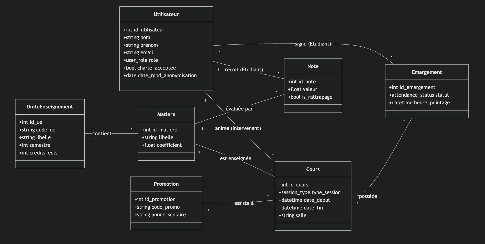
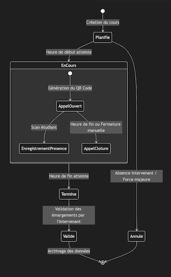
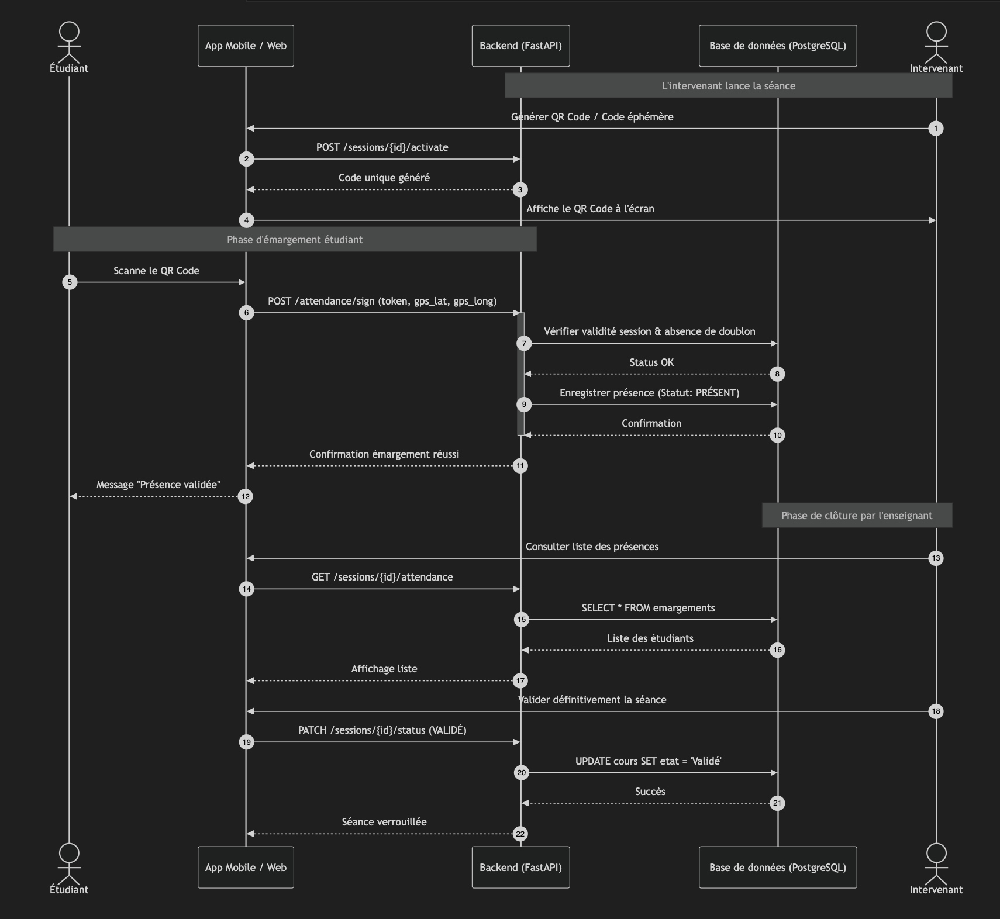
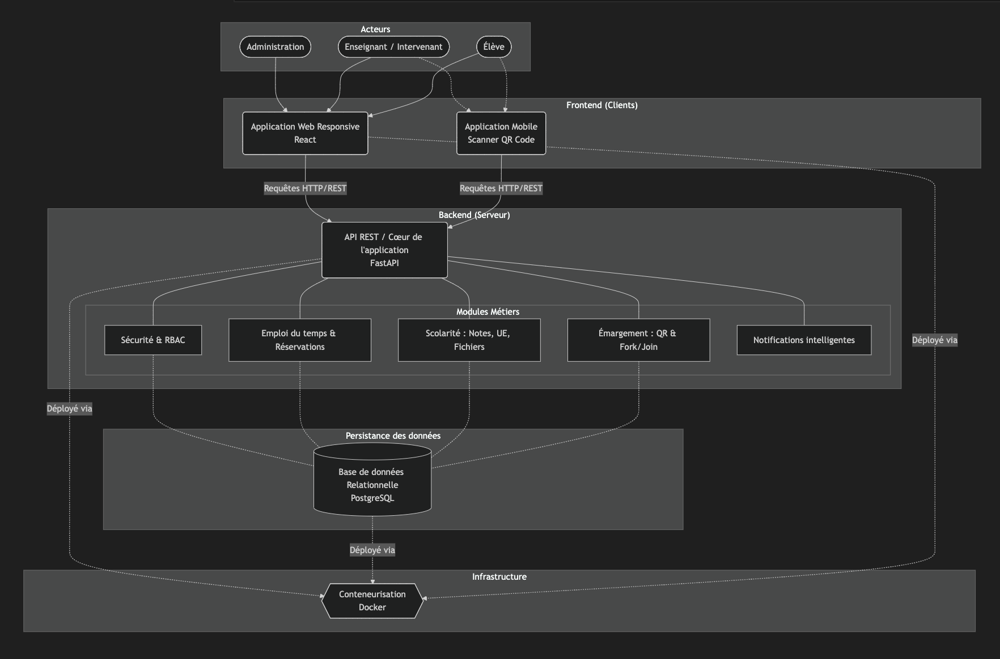
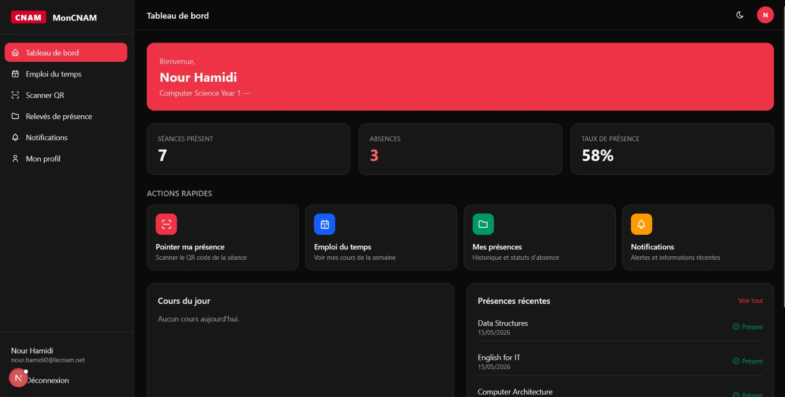
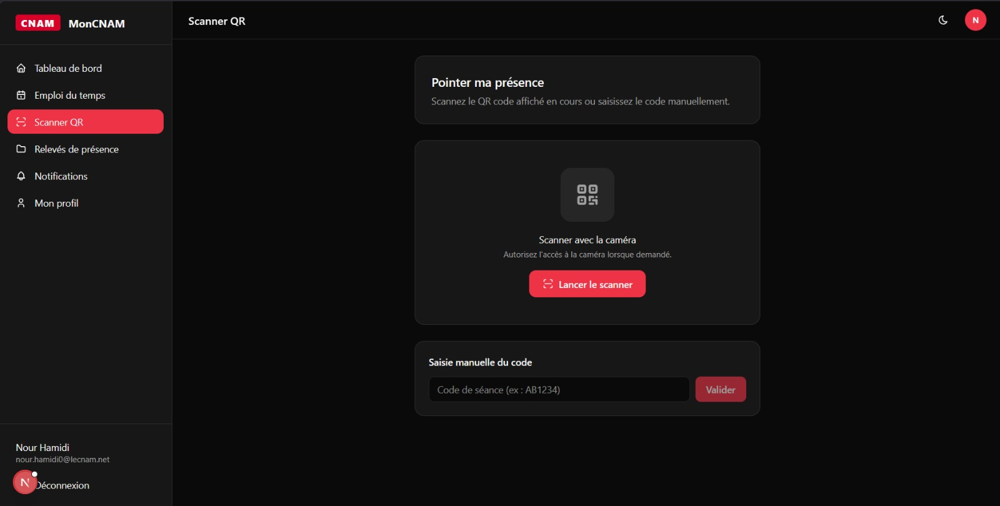
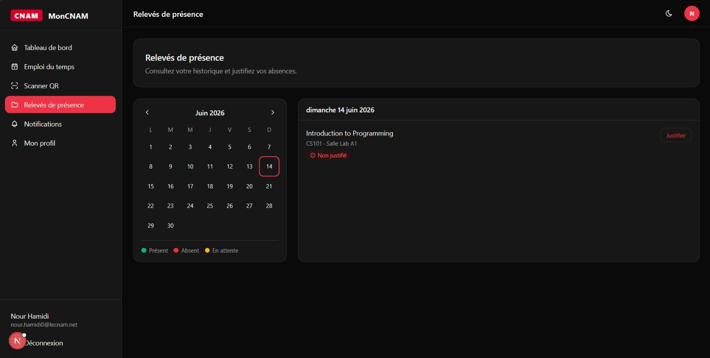
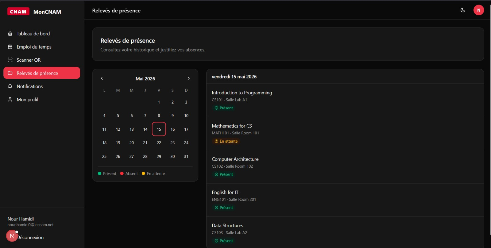
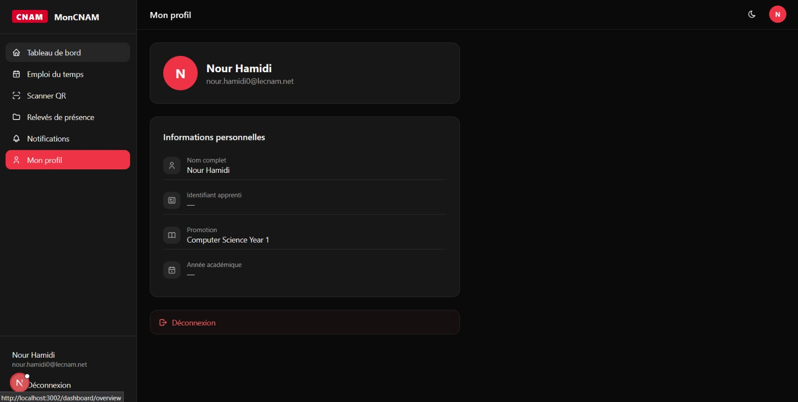

<table>
<tr>
<td style="vertical-align:top; padding-right:1.5em; width:60%;">
<h1>Rapport n°3</h1>
<ul>
<li>Membres :<ul>  
	<li>Yassine ELKHALKI</li>
	<li>Léna RUHAULT</li>
	<li>Ismail CETINOVA</li>
	</ul>
	</li>
<li>Dépôt Github : <a href='https://github.com/YassouSensai/MonCNAM.git'>https://github.com/YassouSensai/MonCNAM.git</a></li>
</ul>
</td>
<td style="vertical-align:top; text-align:right; width:40%;">

</td>
</tr>
</table>

---

# Sommaire
### Élements rapport 1
1. [Introduction](#introduction)
    - [Le sujet](#sujet)
    - [Le besoin](#besoins)
2. [Spécification des besoins](#specification-des-besoins)
    - [Les besoins fonctionnels](#besoins-fonctionnels)
    - [Les besoins non fonctionnels](#besoins-non-fonctionnels)
3. [Organisation du projet](#organisation-du-projet)
    - [Méthodologie et outils](#méthodologie-et-outils)
    - [Planning](#planning)

### Élements rapport 2
4. [Spécifications fonctionnelles et techniques](#spécifications-fonctionnelle-et-technique)
    * [Diagramme de classe / Entité-relation](#diagramme-de-classe--entité-relation)
    * [Diagramme d'état](#diagramme-détat)
    * [Diagramme de séquence](#diagramme-de-séquence)
    * [Diagramme d'architecture](#diagramme-darchitecture)
5. [Choix technologiques](#choix-technologiques)
    * [Frontend](#interface-utilisateur-frontend--react)
    * [Backend](#logique-métier-backend--fastapi-python)
    * [Base de données](#base-de-données--postgresql)
    * [Infrastructure](#infrastructure--docker)

### Élements rapport 3

6. [Les réalisations](#les-réalisations)
7. [Les non réalisations](#les-non-réalisations)
8. [Les difficultés et limites](#les-difficultés-et-limites)
9. [Conclusion](#conclusion)

## Introduction
### Sujet
Le projet consiste à concevoir et développer une plateforme web centralisée dédiée à la gestion administrative et pédagogique de la filière FIP Informatique du Cnam. L'outil s’inspirera du système d’information actuel : [Galao (Landy-Authentification (GALAO))](https://galao.cnam.fr/eiparis/index.php)
permettant le pilotage des promotions, le suivi de l'assiduité, la gestion du cursus académique, l’accès à l’emploi du temps…

En supplément et en fonction du temps, une fonctionnalité innovante sera ajoutée : elle permettra aux élèves d'émarger à chaque cours via leur smartphone, et aux professeurs d'accéder aux présences de façon digitalisée et sécurisée.

### Besoins
Le projet répond au besoin de moderniser et de centraliser la gestion de la filière en créant une plateforme web unique, enrichie de fonctionnalités collaboratives. L’objectif est de simplifier le quotidien de trois types d’utilisateurs :

- **Pour l’administration :** Piloter efficacement les promotions, suivre le parcours académique des élèves (notes, crédits) et garantir la conformité du suivi d'assiduité, un point critique pour les formations en alternance.

- **Pour les enseignants :** Supprimer la gestion manuelle des présences grâce à un outil digital permettant de visualiser et de valider l'appel en temps réel.

- **Pour les élèves :** Offrir un point d'accès unique pour consulter l'emploi du temps et permettre un émargement numérique rapide et autonome lors des cours.

Ce projet vise à transformer un système d'information de gestion classique en un outil de pilotage dynamique, fluidifiant la communication entre l'école, les intervenants et les étudiants.

## Spécification des besoins
### Besoins fonctionnels
La plateforme doit avant tout servir de point de contact quotidien pour les différents acteurs de la FIP. Au cœur du système, l’emploi du temps constitue le besoin primaire : il est impératif que les étudiants et les enseignants puissent consulter en temps réel leur planning personnalisé, avec une distinction claire des salles et des enseignements via un code couleur intuitif. Pour l’administration, la plateforme doit offrir une souplesse totale permettant de planifier des cours, des examens ou des réunions, tout en gardant une visibilité sur la disponibilité des salles.

En ce qui concerne le suivi pédagogique, l'étudiant doit disposer d'un accès strictement personnel à son propre relevé de notes. Les notes sont agrégées par matières, elles-mêmes regroupées dans des Unités d'Enseignement (UE) réparties sur des semestres. Le système doit être capable de gérer l'opérabilité des coefficients et les spécificités des tests de langue pour calculer automatiquement les moyennes pondérées, tout en archivant les résultats pour les sessions de rattrapage. Parallèlement, chaque cours doit devenir un espace de partage où l'enseignant dépose ses supports (slides, exercices, annales) et définit les modalités d'évaluation, avec la possibilité de rendre certaines informations publiques ou de les restreindre aux inscrits.

Un besoin critique identifié concerne la justification de l'assiduité, indispensable dans le cadre de l'apprentissage. La plateforme doit automatiser ce processus : à chaque début de cours, un code unique et éphémère doit être généré aléatoirement par le système. L'étudiant a alors la responsabilité de valider sa présence en saisissant ce code ou en scannant un QR code depuis son interface. L'enseignant doit cependant conserver une autorité de contrôle, lui permettant de valider ou d'invalider manuellement les présences en fin de séance pour garantir la fiabilité des registres.

Enfin, la fluidité de l'information doit être assurée par un système de notifications intelligent. Il ne s'agit pas seulement d'envoyer des emails, mais de cibler précisément les groupes concernés (apprentis d'une promotion, tuteurs, ou intervenants spécifiques) pour les informer d'un changement d'emploi du temps, de la publication d'une nouvelle note ou de la mise à disposition d'un document.

### Besoins non fonctionnels
La plateforme doit avant tout reposer sur une sécurité d'accès rigoureuse, étant donné la sensibilité des données académiques et personnelles traitées. Le système doit intégrer une gestion des droits basée sur les rôles (RBAC), garantissant que seuls les administrateurs peuvent modifier les structures de cours, tandis que les étudiants et enseignants sont strictement cantonnés à leurs périmètres respectifs. L'intégrité des données est primordiale : chaque accès et modification critique (comme la saisie des notes) doit être sécurisé et tracé. De plus, la conformité juridique est assurée par l'obligation pour chaque utilisateur de signer numériquement la charte informatique de l'établissement avant toute navigation, répondant ainsi aux exigences de responsabilité partagée.  

Sur le plan de l'ergonomie et de l'interface, le système doit impérativement respecter la charte graphique du Cnam afin d'offrir une expérience utilisateur cohérente avec les autres outils institutionnels. L'interface doit être "responsive", permettant une consultation fluide sur ordinateur pour la gestion administrative, mais aussi sur smartphone pour les étudiants, notamment pour la saisie rapide des codes de présence en début de cours. L'accent doit être mis sur la simplicité et la clarté : l'emploi du temps doit être lisible en un coup d'œil et les formulaires de saisie de notes doivent minimiser les risques d'erreurs de frappe par des contrôles de cohérence immédiats.  

En termes de performance et de disponibilité, l'architecture doit être conçue pour supporter des pics de connexion simultanés, typiquement lors des débuts de cours pour l'émargement ou lors de la publication des résultats d'examens. L'utilisation de technologies modernes comme FastAPI et React, couplée à une base de données robuste tel que PostgreSQL, doit garantir des temps de réponse inférieurs à la seconde pour les requêtes courantes. La conteneurisation via Docker est une exigence technique forte : elle doit permettre un déploiement reproductible et simplifié, facilitant la maintenance et les futures évolutions de la plateforme par de nouvelles équipes.  

Enfin, la maintenabilité et la scalabilité sont des piliers du projet. Le code doit être structuré de manière modulaire pour que de nouvelles fonctionnalités puissent être ajoutées sans compromettre l'existant. L'archivage des données est également une contrainte majeure : le système doit être capable de conserver l'historique des notes et des promotions sur plusieurs années, tout en respectant les principes du RGPD concernant la durée de conservation des données personnelles et la possibilité d'exportation pour l'archivage administratif.  

## Organisation du projet
### Méthodologie et outils
Au vu de la durée du projet et de l'importance d'une bonne coordination entre nos trois membres, nous avons décidé de partir sur une organisation linéaire des tâches et non sur une méthodologie agile.
Voici ci-dessous la liste des tâches (non exhaustive).

Pour chaque tâche, chacun des membres interviendra. Ainsi nous nous coordonnons via Github Project. En effet chaque tâche sera divisée en plusieurs sous tâches que nous pourrons nous approprier.

### Planning
Planning non définitif en nombre d'heures ce qui comprend les heures du planning et les heures de travail en plus.

Pour mieux visualiser le planning, il se trouve [ici](https://docs.google.com/spreadsheets/d/1oUmpsSupdnOnIuKPobgLwjDSZzqKR4bn/edit?usp=sharing&ouid=116375194152172433178&rtpof=true&sd=true) au format excel.

## Spécifications fonctionnelle et technique
### Diagramme de classe / Entité-relation
Le diagramme suivant illustre l'architecture logique de notre projet : la plateforme "MonCNAM" qui permet la gestion administrative et pédagogique de la filière FIP du CNAM. Il met en évidence la séparation entre le référentiel statique, c'est à dire les UEs, les matières et les données dynamiques comme les cours, les notes et les émargements pour le suivi des présences.

**Spécification des principales entités**

- **Utilisateurs :** Entité centrale qui va gérer l'authentification, les droits et l'accès aux différentes fonctionnalités selon le rôle de l'utilisateur.
- **Promotion :** Regroupe les élèves par année scolaire et par code (ex : DICASI-2026). C'est la promotion qui est concernée par un  emploi du temps donné.
- **UniteEnseignement & Matiere :** Les deux entités pour la gestion des enseignements. D'un côté le regroupement thématique des matières par semestre et crédits ECTS et de l'autre les matières.
- **Cours & Emargement :** Pour gérer le déroulement des cours et les présences.

Nous avons également prévu un champ ***date_rgpd_anonymisation*** pour gérer le cycle de vie des données personnelles (notamment en fin de formation par exemple)

### Diagramme d'état
Le diagramme d'état ci-dessous modélise le cycle de vie complet d'une séance de cours, de sa planification initiale à sa validation finale par l'enseignant. Cette modélisation définit les fenêtres temporelles durant lesquelles les interactions seront réalisées tout en garantissant l'intégrité des données d'émargement.

**Description des états**

- **Planifié :** Cet état correspond à l'existence du cours dans l'emplois du temps avant l'heure de début.
- **En cours :** Il s'agit de la phase active. C'est un état composite qui gère la logique d'émargement via scan d'un qr code généré par l'enseignant. L'enseignant pourra compléter l'emargement à la fin du cours si certains élèves n'ont pas scanné le qr code (état terminé), puis valider l'émargement (état validé).
- **Annulé :** En cas de force majeur ou enseignant absent, alors le cours est annulé.

### Diagramme de séquence
Ce diagramme illustre les interactions dynamiques entre les acteurs et la plateforme MonCNAM lors du processus d'émargement numérique.

**Déroulement de la séquence**

- **L'initialisation :** L'intervenant génère via le Backend un jeton unique (QR Code) qui correspond à la session courante.
- **L'émargement :** L'étudiant scanne le code. L'API vérifie immédiatement la validité du jeton, s'assure que l'étudiant n'a pas déjà émargé (unicité) et valide la présence en base de données (que l'étudiant appartient bien au cours pour lequel il émarge). L'intégration de coordonnées GPS optionnelles permet de contrer la fraude (scan à distance), mais on ne sait pas encore si le temps nous permettra d'implémenter cette fonctionnalité.
- **La validation :** L'intervenant récupère la liste mise à jour en temps réel. La clôture de la séance verrouille les données pour empêcher toute modification ultérieure. 

### Diagramme d'architecture
MonCNAM repose sur une architecture moderne type client-serveur

L'architecture est scindée en plusieurs couches indépendantes communiquant via des requêtes HTTP/REST, ce qui permet d'isoler la logique métier (Backend) de l'interface utilisateur (Frontend). L'ensemble est encapsulé dans une infrastructure conteneurisée pour garantir l'uniformité entre les environnements de développement et de production.

## Choix technologiques

Afin de répondre aux exigences de fonctionnement et de modernisation de MonCNAM (Galao actuellement), nous avons fait des choix avec des technologies que l'on connait déjà et d'autres non dans le but de consolider nos compétences et d'en acquérir de nouvelles.

### Interface Utilisateur (Frontend) : React  
Nous avons opté pour la bibliothèque React. Son architecture orientée composants permet de développer une interface riche et réutilisable (ex: les grilles d'emploi du temps). De plus, React facilite la création d'une application "Responsive" capable de s'adapter aussi bien aux écrans d'ordinateur de l'administration qu'aux smartphones des étudiants (nécessaire pour la fonctionnalité de scan). Nous avons la possibilité de découvrir cette technologie en cours de SI WEB.

### Logique Métier (Backend) : FastAPI (Python)
En ce qui concerne le backend, nous avons choisi d'utiliser FastAPI. Il s'agit d'un framework Python qui est particulièrement performant grâce à sa gestion native de l'asynchronisme. C'est un choix primordial pour notre système d'émargement : en début de cours, l'API va subir des pics de charge importants (plusieurs dizaines d'étudiants scannant un QR code dans la même minute) et FastAPI nous permettra de traiter ces flux simultanés sans bloquer le serveur. De plus, il génère automatiquement la documentation de l'API (Swagger), facilitant la coordination entre le développement Front et Back. Etant tous les trois à l'aise avec Python, il sera plus simple pour nous de manipuler ce framework bien que nous n'avions jamais travaillé avec auparavant.

### Base de données : PostgreSQL
Pour la persistance des données, nous avons choisi PostgreSQL. C'est un SGBD (Système de Gestion de Base de Données) reconnu pour sa fiabilité et de plus en plus utilisé en entreprise (y compris celle dans laquelle nous exerçons notre apprentissage). La nature des données traitées (notes d'étudiants, présences ayant un impact sur la diplomation, contraintes d'unicité) exige une structure relationnelle forte et intègre (difficile d'utiliser une BD NoSQL)

### Infrastructure : Docker
L'ensemble des services (Frontend, Backend, Base de données) sera conteneurisé via Docker. Ce choix répond à une contrainte forte de maintenabilité : il garantit que la solution fonctionnera à l'identique sur nos postes de développement locaux, lors des tests, et pour la potentielle mise à disposition sur un serveur privé nous appartenant ou bien sur un cloud public à moindre coût. Le choix de docker nous permet également de nous familiariser avec des outils et pratiques largement utilisés en environnement professionnel.

## Les réalisations
Malgré un calendrier serré, nous sommes parvenus à mettre en place un Produit Minimum Viable (MVP) robuste, en se concentrant sur les fondations architecturales et le backend du projet plutôt que sur la multiplication des fonctionnalités.

Nos principales réalisations se concentrent sur les aspects suivants :  

* **Mise en place de l'infrastructure et conteneurisation :** Nous avons réussi à mettre en place l'ensemble de la stack technique (Base de données PostgreSQL, Backend FastAPI et Frontend React) via Docker. Cela garantit un environnement isolé, reproductible et prêt à être déployé sur un serveur.  

* **Architecture de la base de données :** Le schéma relationnel a été intégralement modélisé et instancié. Les relations entre les utilisateurs, les unités d'enseignement et les plannings sont fonctionnelles au niveau de la persistance des données.

* **Développement de l'API REST (Backend) :** Avec FastAPI, nous avons développé les routes principales permettant l'authentification sécurisée des utilisateurs, la récupération des informations de profil, et l'affichage basique des emplois du temps. La documentation automatique via Swagger est opérationnelle.  

* **Interface Utilisateur (Frontend) :** Il s'agit de notre axe d'amélioration principal. Compte tenu de nos appétences plus limitées pour le développement front, du temps restreint et d'une inversion de notre planning initial (nous avons développé le back avant le front, contrairement à ce qui était prévu), nous avons dû nous adapter. Nous avons eu recours à plusieurs modèles d'agents IA afin de nous aider à développer le front. Bien que nous ne soyons pas pleinement satisfaits du rendu visuel final, l'application développée en React reste fonctionnelle et propose un affichage dynamique qui s'adapte correctement en fonction du type d'utilisateur (RBAC).

## Les non réalisations 
* **Le système de géolocalisation pour contrer la fraude :** En phase d'analyse, nous nous sommes rendu compte que cette fonctionnalité posait non seulement des défis techniques d'intégration avec l'API du navigateur/mobile, mais soulevait également des questions juridiques complexes liées au RGPD (traitement des données de localisation des étudiants). Elle a donc été écartée de cette version.

* **Le système de notifications automatisées :** La gestion d'envois de mails ciblés (lorsqu'une note est publiée ou qu'un cours est annulé) a été modélisée dans la base de données, mais le service d'envoi en arrière-plan (workers asynchrones) n'a pas été implémenté pour nous concentrer sur le cœur fonctionnel.

* **Le développement d'une application mobile native :** Bien que l'utilisation sur smartphone (notamment pour le scan des QR codes d'émargement) soit au cœur de l'expérience étudiant, nous avons pris la décision de ne pas développer d'application mobile dédiée (de type React Native ou Flutter). Le maintien de deux bases de code distinctes ou l'apprentissage d'un framework mobile supplémentaire aurait représenté une charge de travail incompatible avec nos délais. Nous avons donc privilégié la création d'une interface web React pleinement "responsive", accessible directement depuis le navigateur du téléphone, ce qui remplit parfaitement le cahier des charges tout en maîtrisant la complexité technique.

## Les difficultés et limites

Ce projet de fin d'année a été particulièrement riche en défis techniques, ce qui nous a poussés à sortir de notre zone de confort et à revoir notre organisation :

* L'une de nos plus grandes difficultés a été la prise en main simultanée de plusieurs technologies modernes que nous découvrions principalement React et FastAPI car nous avions eu des bases en Docker notamment grâce au cours de Dev WEB avec M. Fontaine. L'assimilation des concepts liés à l'asynchronisme en Python et à la gestion des états (hooks) en React a absorbé une part importante de notre temps de développement initial.  

* La gestion du temps et le rythme d'alternance : Le temps imparti s'est révélé être un défi majeur, fortement accentué par notre rythme d'alternance. La fragmentation de notre emploi du temps, avec des coupures nettes entre notre semaine en entreprise et notre semaine de cours, a rendu difficile le maintien d'une dynamique de développement continue. Couplé à notre phase de découverte des technologies (React et FastAPI), ce fractionnement nous a imposé de faire preuve d'une grande agilité et de revoir nos priorités en cours de route pour garantir la livraison d'un produit fonctionnel.

* L'intégration Front/Back : Si le développement isolé des deux couches s'est bien déroulé, leur communication a généré plusieurs obstacles techniques. La configuration de la gestion des échanges de tokens JWT pour l'authentification a nécessité un investissement conséquent en termes de débogage.  

* La structuration du code Frontend : Dans le but d'accélérer le développement de l'interface, nous avons parfois manqué de recul sur l'architecture et le découpage de nos composants React. La création de composants parfois trop monolithiques ou trop couplés à nos règles métiers s'est avérée difficile à maintenir sur la durée, ce qui limite aujourd'hui la flexibilité et l'évolutivité de notre interface.

## Quelques captures d'écrans de notre application :

## Conclusion

La conception et le développement de la plateforme MonCNAM ont représenté une expérience extrêmement formatrice pour notre groupe, marquant une véritable transition entre les projets académiques classiques et les réalités du développement logiciel en entreprise.  

Bien que le produit final ne couvre pas l'intégralité du périmètre initialement imaginé, nous sommes fiers d'avoir réussi à livrer une architecture saine et conteneurisée. Ce projet nous a permis d'assimiler des concepts d'ingénierie fondamentaux : la modélisation complexe d'un système d'information, la création d'une API REST avec FastAPI, et les principes d'authentification par rôle.  

Au-delà de la technique, cette expérience a mis en lumière l'importance cruciale de la gestion de projet, de la planification et de la priorisation des tâches face aux imprévus. MonCNAM dispose aujourd'hui d'une base technologique solide qui ne demande qu'à être enrichie. Les fondations sont prêtes pour accueillir les futures évolutions, confirmant ainsi la pertinence de nos choix architecturaux initiaux.

Si nous devions reprendre le développement de MonCNAM, notre principale marge d'amélioration se situerait dans notre approche du Frontend. Nous prendrions le temps de mieux concevoir l'architecture de nos composants React en amont, afin de créer une interface plus modulaire et plus facile à faire évoluer. En revanche, le choix de FastAPI a été une véritable réussite : ce framework s'est révélé extrêmement pertinent pour la mise en place rapide d'une API robuste, confirmant que l'expertise de l'écosystème Python constitue un atout majeur en entreprise.

***Important, pour lancer le projet, consultez le README.md disponible à la racine du projet***